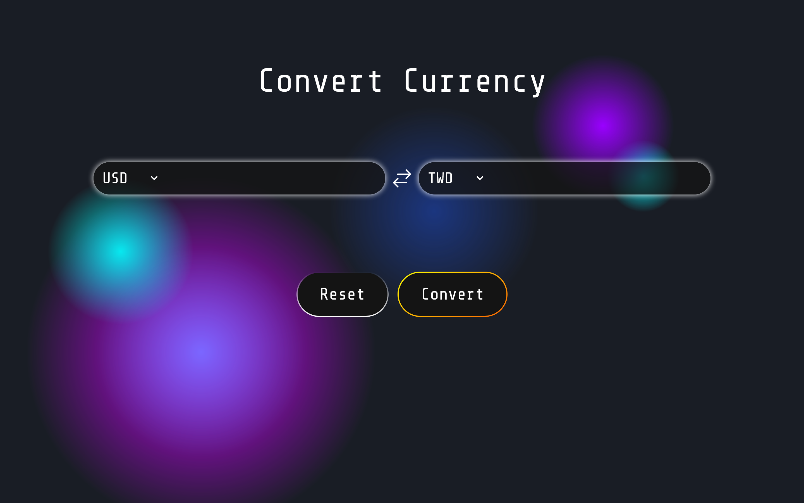
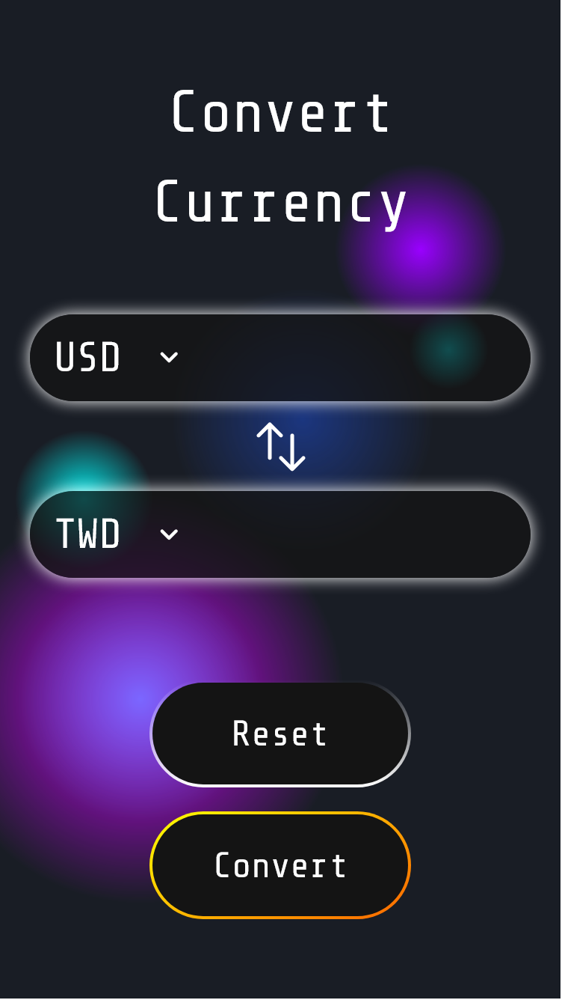

This is a [Next.js](https://nextjs.org/) project bootstrapped with [`create-next-app`](https://github.com/vercel/next.js/tree/canary/packages/create-next-app).

## Built with

- [Next.js](https://nextjs.org/) - React Framework
- [React](https://reactjs.org/) - JS library
- [React Redux](https://react-redux.js.org/) - Official React bindings
- [Tailwind CSS](https://tailwindcss.com/) - CSS library
- [Sass](https://sass-lang.com/) - CSS pre-processor
- [HeroIcons](https://heroicons.com/) - Icons made by Tailwind CSS

## Screenshots

## What I've learned

### Flexible React components 
- Created reusable components such as input and panel components.
- Customized auto-completed components.

### Sass/SCSS
- Generated dynamic 'Tailwind CSS-like' classes using Sass `@each...in...` loop function.
- Stored basic button styles in mixins and implemented different colors using parameters when including the mixins.

### React Redux and Redux toolkits in Next.js
- Implemented state management with React Redux and Redux Toolkit in Next.js.

### Fecth APIs in React Redux
- Utilized `createAsyncThunk` to fetch APIs in React Redux.

## How to Use
1. Search for the original currency you would like to convert from. You can either expand the panel to check all currencies or type the currency directly and choose the matching result in the popup panel.
2. Search for the final currency you would like to convert to. You can either expand the panel to check all currencies or type the currency directly and choose the matching result in the popup panel.
3. Input the amount that you want to convert.
4. Click the convert button and check the result.
5. If you want to exchange the currencies between the selections, please click on the two-way arrow in the middle of the convert input fields.
6. Change the amount if you wish and click the 'Convert' button. You will get the result on the right-hand input field.
7. If you want to reset the amount, please click the 'Reset' button. It will reset all input fields.

## Deploy on Vercel

The easiest way to deploy your Next.js app is to use the [Vercel Platform](https://vercel.com/new?utm_medium=default-template&filter=next.js&utm_source=create-next-app&utm_campaign=create-next-app-readme) from the creators of Next.js.

Check out our [Next.js deployment documentation](https://nextjs.org/docs/deployment) for more details.
